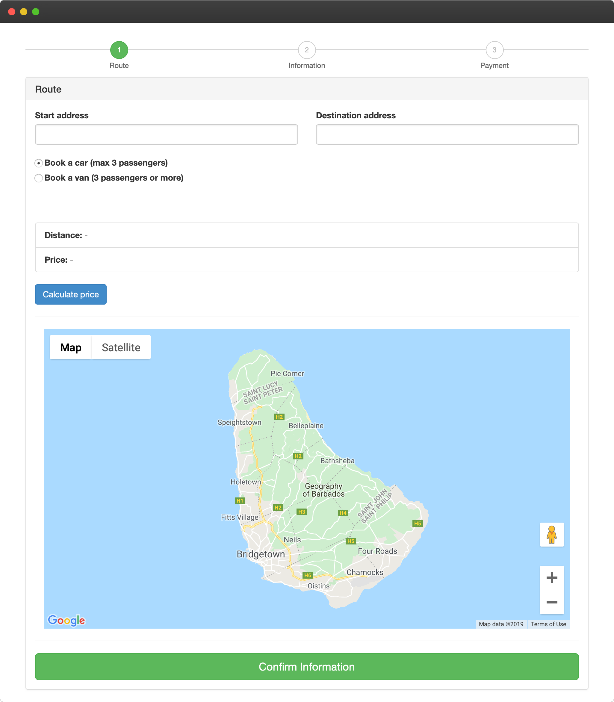
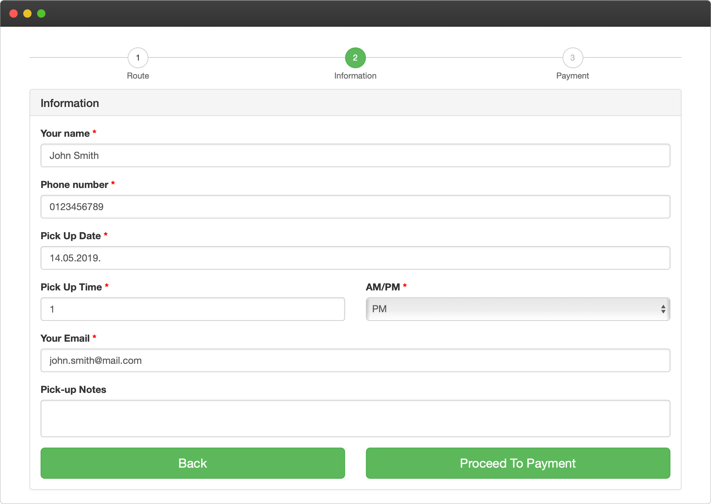

# Online Taxi Reservation Widget
This widget allows users to book a taxi online and pay for it using credit card.

## Duration
- 4.2.2019. - 7.2.2019.

## Technologies used:
- HTML
- CSS
- JavaScript
- jQuery
- PHP
- MySQL
- Bootstrap Framework

## Features

- users can enter start and destination address and when clicked on "Calculate price" the distance, price and route will be shown
- users can choose to book a car (max 3 passengers) or to book a van (3 passengers or more)
- when the addresses are chosen, users are asked to enter reservation information (name, phone number, pick up date and time, email etc.)
- email reservation confirmation
- Google Maps API integration
- Stripe payment integration
 
## Screenshots

*Index page*

*Shown route, distance and price after choosing start and destination address*

*Entering reservation information*

*Entering credit card information (payment is done using Stripe)*
